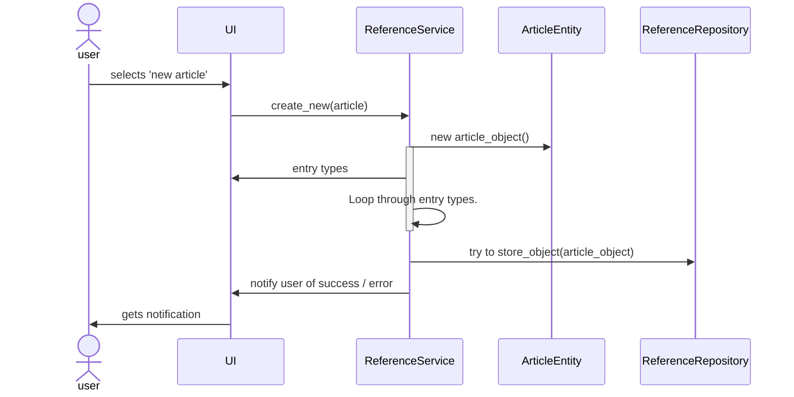
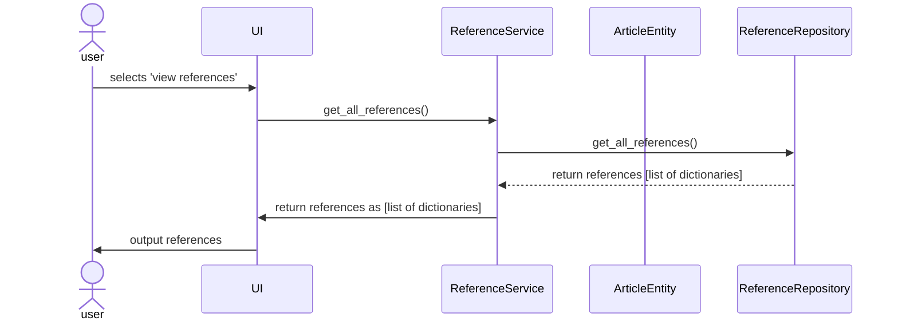

# Architecture

# Main functionalities

These two sequence diagrams were created in the first sprint to help build a common understanding of how the user stories selected for the sprint are to be built.

